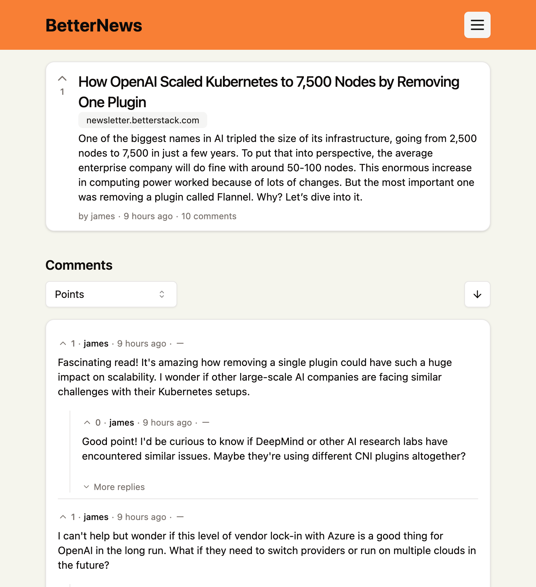

# BetterNews - Fullstack Hacker News Clone

This repo is an implementation of some of the core features of HackerNews. It is developed in the YouTube video linked below. It includes post, comments, nested comments, authentication and deployment with Docker as well.

Utilises the following:

- Hono
- Bun
- DrizzleORM
- Postgres
- Tanstack Router
- Tanstack Query / React Query
- Tanstack Form
- Zod
- TypeScript

## Tutorial

This repo is the code that was written in the following YouTube video. The YouTube chapters match the commits in this repo, so you can easily see what changed when. If any changes have been made since the YouTube video, check the `tutorial` branch for the exact one used in the video.

## Usage

To use this project, you will first need to have a running postgres server. You can set this up with Docker. Instructions can be found in the YouTube video above.

### Development

1. Clone the repo
2. Run `bun install`
3. Add in environment variables to .env
4. Run `bun dev` for backend `cd frontend && bun dev` for frontend

### Production

1. Clone the repo
2. Add in environment variables to .env
3. Build the frontend `cd frontend && bun run build`
4. Run `bun server/index.ts`

## What Next? Future Enhancements

Delete a post but keep thread active?

- Implement a feature where users can delete their posts without removing the entire comment thread. This preserves valuable discussions while allowing users to remove their original content.
  Keep link as well?
- Consider maintaining the original link even if the post is deleted.

React Query Optimizations

- Investigate React Query stale times / refetching
- Experiment with different stale times and refetching strategies to balance performance and data accuracy.

Enhanced Comment Sorting

- Add ability to sort nested comments using search params

Authentication Improvements

- Integrate additional authentication methods using OAuth providers.
- Consider using tools like Clerk for easier implementation of various login options (e.g., Google, GitHub, Twitter).

User Profile Page

- Create a dedicated page for user profiles, showcasing their activity and contributions.
- Display a list of posts that the user has upvoted
- Show a compilation of comments made by the user across different threads

URL Search Refinement

- Modify the search functionality to match posts based on the hostname rather than the exact URL. This improvement helps group similar content from the same source, even if the specific URLs differ.

Advanced Feature: Cursor-based Pagination

- Implement a more efficient pagination system using cursors instead of offset-based pagination. This approach is more performant for large datasets and provides a smoother user experience when navigating through lots of content.
